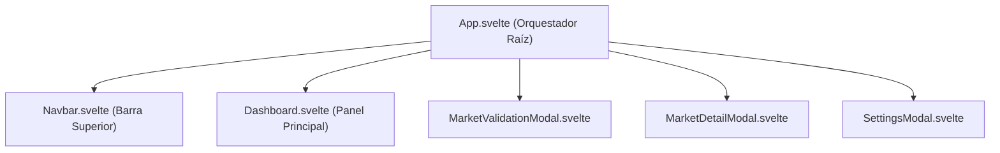

# 💻 AutoSentinel Frontend - Interfaz de Usuario SPA (Svelte 5 + Vite)

Aplicación cliente de tipo **Single Page Application (SPA)** construida con **Svelte 5** (utilizando la nueva sintaxis de *Runes*) y empaquetada con **Vite 8**. Provee una interfaz moderna con diseño **Glassmorphism**, panel reactivo de oportunidades automotrices, modales de validación estadística dual de mercado y paneles de configuración en tiempo real.

---

## 📂 Estructura de Directorios (`frontend/`)

```text
frontend/
├── public/
│   ├── favicon.svg             # Isotipo vectorizado para la pestaña del navegador
│   └── icons.svg               # Sprites vectoriales de íconos del sistema
├── src/
│   ├── assets/
│   │   ├── hero.png            # Imagen ilustrativa para componentes de estado vacío
│   │   ├── svelte.svg          # Isotipo oficial de Svelte
│   │   └── vite.svg            # Isotipo oficial de Vite
│   ├── lib/
│   │   ├── Counter.svelte      # Componente de prueba básico con Svelte Runes
│   │   ├── Dashboard.svelte    # Panel principal con tarjetas de vehículos, búsqueda y semáforo
│   │   ├── MarketDetailModal.svelte # Modal con detalle de muestra estadística (Mín, Máx, Mediana, Promedio)
│   │   ├── MarketValidationModal.svelte # Modal interactivo para disparar y monitorear la validación dual
│   │   ├── Navbar.svelte       # Barra superior de navegación, indicadores de estado y disparadores
│   │   └── SettingsModal.svelte # Modal de ajustes del Centinela, Calculadora y subida de credenciales
│   ├── app.css                 # Sistema de diseño global (Glassmorphism, variables HSL, tokens UI)
│   ├── App.svelte              # Componente raíz orquestador de estado global y vistas modales
│   └── main.js                 # Punto de entrada JavaScript e inicialización de la app
├── index.html                  # Contenedor HTML5 raíz (`#app`)
├── jsconfig.json               # Configuración de resolución de módulos e IntelliSense
├── package.json                # Especificación de dependencias (Svelte 5, Vite 8) y scripts
├── svelte.config.js            # Configuración del compilador de Svelte
└── vite.config.js              # Configuración de empaquetado y servidor de desarrollo Vite
```

---

## 🛠️ Tecnologías y Librerías

- **Svelte 5 (`^5.56.10`):** Framework UI ultrarrápido sin Virtual DOM, utilizando reactividad basada en Runes (`$state`, `$derived`, `$effect`).
- **Vite 8 (`^8.2.2`):** Servidor de desarrollo con Hot Module Replacement (HMR) instantáneo y empaquetado optimizado para producción.
- **@sveltejs/vite-plugin-svelte (`^7.3.0`):** Integración oficial de Svelte para Vite.
- **CSS3 Nativo:** Diseño personalizado con Glassmorphism (`backdrop-filter: blur`), CSS Grid/Flexbox y paleta de colores HSL.

---

## 💻 Instalación y Ejecución Local

### 1. Requisitos Previos
Asegúrate de contar con Node.js v18.0 o superior instalado.

### 2. Instalación de Dependencias
```bash
cd frontend
npm install
```

### 3. Ejecución en Modo Desarrollo
```bash
npm run dev
```
La aplicación se abrirá por defecto en: **`http://localhost:5173`**.

> [!NOTE]
> Para que el frontend funcione correctamente, debes mantener en ejecución el servidor backend en `http://127.0.0.1:8000`.

### 4. Compilación para Producción
```bash
npm run build
```
Los archivos optimizados y minificados para despliegue se generarán en la carpeta `frontend/dist/`.

### 5. Previsualizar Build de Producción
```bash
npm run preview
```

---

## 🧩 Arquitectura de Componentes (`src/lib/`)



### 1. `App.svelte` (Orquestador Principal)
- Administra el estado global de la aplicación (`vehicles`, `stats`, `selectedScoreFilter`, `searchQuery`).
- Ejecuta sondeos periódicos cada 10 segundos al backend (`/api/stats` y `/api/vehicles`).
- Controla la visibilidad de los modales flotantes.

### 2. `Navbar.svelte` (Barra de Navegación)
- Muestra el estado en vivo de la API (`Online` / `Offline`).
- Indica si la sesión de Facebook está guardada en `auth.json`.
- Permite disparar la captura interactiva de sesión en Facebook.
- Permite ejecutar manualmente el Centinela en segundo plano.

### 3. `Dashboard.svelte` (Panel de Oportunidades)
- Presenta las tarjetas de vehículos clasificados por el Semáforo.
- Incluye barra de búsqueda en tiempo real y pestañas de filtrado (Todos, Verde, Amarillo, Rojo).
- Permite alternar la visualización del mercado de comparación (**Chileautos** vs **Facebook Marketplace**).
- Muestra métricas clave: Precio Publicado, Mediana de Mercado, Impuesto Transferencia (1.5%), Colchón Mecánico y Margen Estimado ($).

### 4. `MarketValidationModal.svelte` (Validación Dual de Mercado)
- Permite ingresar o corregir Marca, Modelo y Año de un auto.
- Dispara los micro-scrapers paralelos para consultar Chileautos y Marketplace.

### 5. `MarketDetailModal.svelte` (Detalle Estadístico)
- Muestra el desglose de la muestra extraída:
  - Número de publicaciones válidas procesadas.
  - Precio Mínimo y Precio Máximo detectados.
  - Precio Promedio y Mediana de Mercado.

### 6. `SettingsModal.svelte` (Configuración y Ajustes)
- Permite modificar presupuestos (Mín/Máx), intervalo de scraping (horas), colchón mecánico predeterminado y porcentaje de impuesto de transferencia.
- Permite subir el archivo `service_account.json` para integración con Google Sheets.
- Incluye el botón de purga masiva de datos con modal de confirmación de seguridad.

---

## 🎨 Sistema de Diseño y Estilos (`src/app.css`)

El diseño de la aplicación está construido con un **Design System** personalizado en CSS3:

- **Estética Glassmorphism:** Tarjetas transparentes con fondos desdibujados `backdrop-filter: blur(16px)` y bordes sutiles.
- **Paleta de Colores HSL:**
  - Fondos Oscuros: `hsl(222, 47%, 11%)`
  - Acentos Primarios (Cyan/Azul): `hsl(199, 89%, 48%)`
  - Semáforo Verde: `hsl(142, 71%, 45%)`
  - Semáforo Amarillo: `hsl(45, 93%, 47%)`
  - Semáforo Rojo: `hsl(0, 84%, 60%)`
- **Tipografía y Componentes:** Botones con estados *hover/disabled*, insignias (*badges*) animadas e insumos con foco resaltado.

---

## 🔌 Comunicación con la API REST Backend

El frontend consume de forma directa los endpoints del backend en `http://127.0.0.1:8000/api`:

| Componente | Endpoint Consumido | Método | Acción |
| :--- | :--- | :--- | :--- |
| `App.svelte` | `/api/stats` | `GET` | Actualiza métricas de la barra superior. |
| `App.svelte` | `/api/vehicles` | `GET` | Recupera el listado filtrado de vehículos. |
| `Navbar.svelte` | `/api/auth/facebook` | `POST` | Dispara el navegador headed para login. |
| `Navbar.svelte` | `/api/sentinel/run` | `POST` | Ejecuta el centinela en segundo plano. |
| `MarketValidationModal` | `/api/vehicles/{id}/validate-market` | `POST` | Ejecuta validación dual de mercado. |
| `SettingsModal` | `/api/config` | `GET` / `PUT` | Consulta y actualiza la configuración global. |
| `SettingsModal` | `/api/auth/google-sheets/credentials` | `POST` | Sube archivo `service_account.json`. |
| `SettingsModal` | `/api/vehicles` | `DELETE` | Borrado masivo de la base de datos. |
